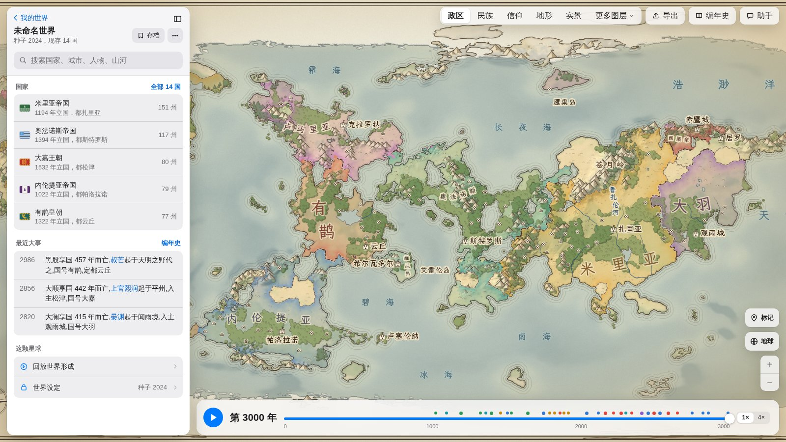
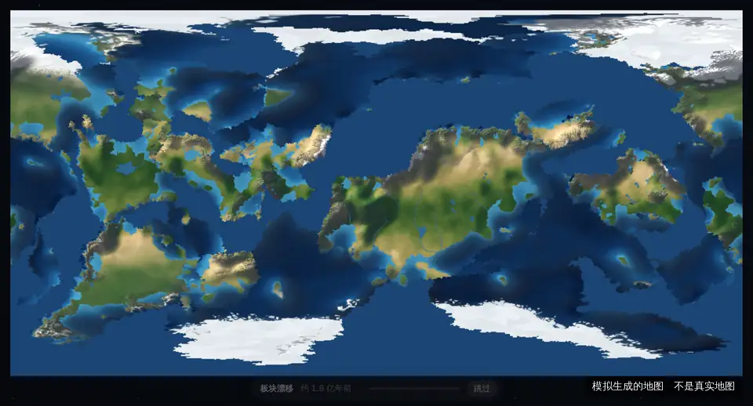
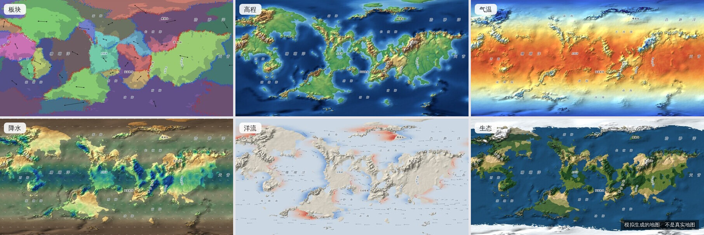
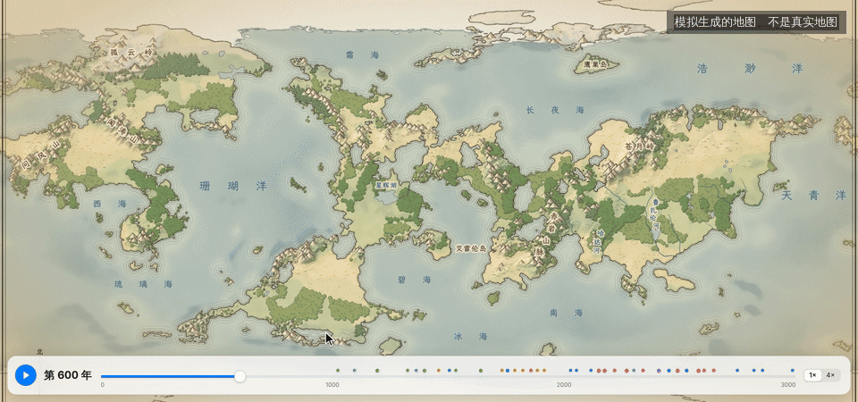
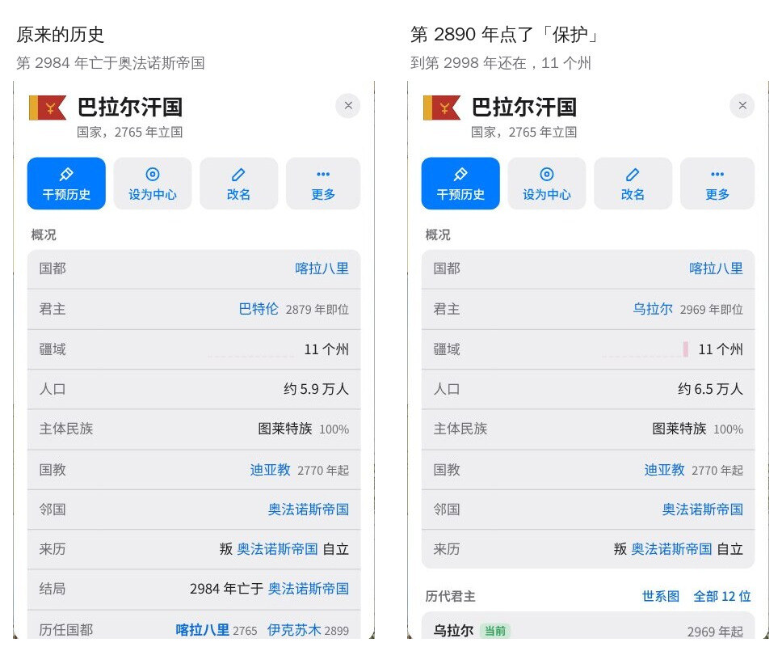
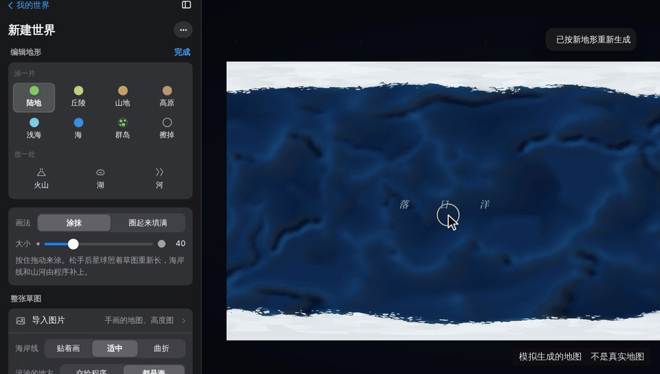
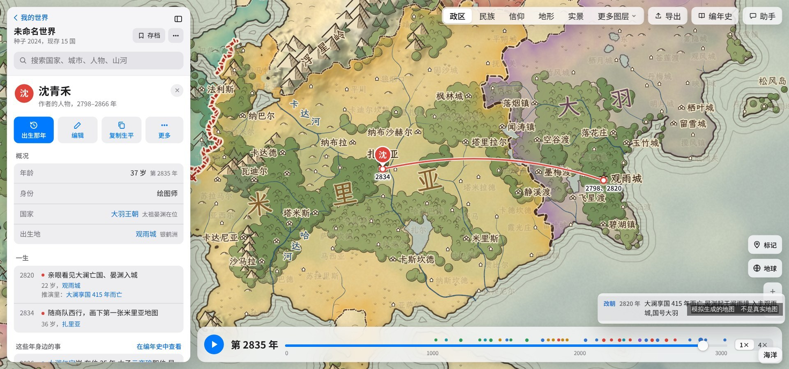
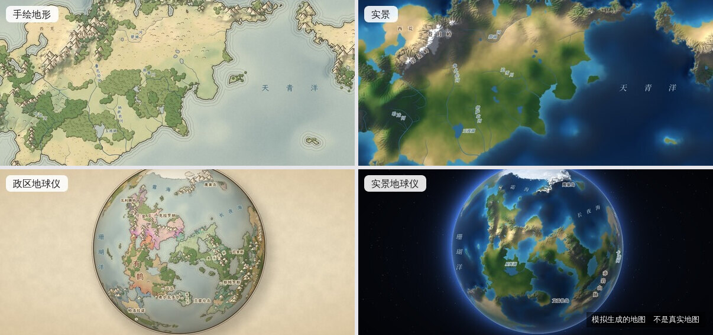

<h1>
  <picture>
    <source media="(prefers-color-scheme: dark)" srcset=".github/readme/logo-dark.svg">
    
  </picture>
</h1>

在浏览器里生成一颗完整的星球并推演它的历史：用板块运动、河流侵蚀、气候与洋流算出地形和生态，再模拟民族、国家、战争与王朝更替，得到可以编辑的地图和编年史。面向小说、设定集、跑团等原创世界观创作。

**[在线使用](https://atlas.gerdor.top)** | [路线图](#路线图) | [开发说明](docs/development.md) | [反馈问题](https://github.com/guaner-334/civ-atlas/issues) | [QQ 交流群 925687934](#反馈与参与)

[](LICENSE)
[](https://github.com/guaner-334/civ-atlas/releases)



<sub>本页图片均为程序模拟生成的地图，不是真实地图。</sub>

网站免费使用。生成、推演、编辑、存档和导出全部在浏览器中完成，不需要安装或注册。同一版本下，相同的种子和参数在任何设备上生成逐位一致的世界；存档只记录种子、参数和修改，通常只有几 KB。

## 特性

### 星球生成



- **球面网格**：球面泊松圆盘采样加球面 Delaunay 三角剖分，默认约 3.6 万个不规则地块，可调到 20 万。地图东西相连、包含两极，没有平面拼接缝。
- **板块构造**：大小悬殊的板块绕欧拉轴运动；汇聚带造山，俯冲带形成海沟，离散带形成洋中脊。生成大陆、微大陆、岛弧和极地大陆。
- **河流侵蚀**：流水功率侵蚀定律（stream power law），用 Braun & Willett (2013) 的隐式解法求解；Priority-Flood 填平洼地，河网和湖泊由排水计算得出。
- **气候**：气温按纬度和海拔计算；三圈环流的风带顺风输送水汽，迎风坡多雨，背风坡形成雨影。
- **洋流**：按大洋环流的规律布置暖流、寒流和沿岸上升流，改变沿岸的气温和降水。
- **生物群落**：按年均温和年降水（Whittaker 图）划分雨林、草原、荒漠、苔原等。



### 历史推演



- **民族与国家**：民族从发源地沿宜居地扩散，受山脉、海洋、荒漠阻隔；建城、立国、扩张，战争与议和，分裂、合并、复国、迁都。
- **王朝与人物**：王朝更替和世系；每位君主、将领都有生平（在位年份、父子、前任与继任、亲征、结局），每个朝代一棵家谱树。
- **社会变迁**：民族同化与迁徙，城市兴衰（洗劫、毁城、重建、旧都衰落），宗教从大城市传播，成为国教并分出教派。
- **编年史**：推演中的事件写成中文纪事，可以按国家筛选，点击一条跳到对应的年份和地点。
- **国旗**：按民族、国体和王室起源为每个国家生成国旗，随改朝换代、分裂、复国变化。
- **地名**：山、河、湖、海、国家、城市按多种语感自动命名，按中文地图的习惯排版；新建世界时可以设置中原、江南、帝国、北境等 12 种语感各占多少，默认自动。
- **时间轴**：可以播放或拖动到任意一年查看当时的政区。


### 编辑与创作

- **干预历史**：保护、禁止分裂、禁止扩张、结盟、宣战、迁都，或在某一州立国、把它划给别国，从指定年份起重新推演。
- **改名**：国家、城市、山河都能改名；名称绑定在稳定的标识上，重新推演后仍然保留。
- **作者的人物**：添加自己故事里的人物（生卒、出生地、经历、亲友），经历和亲友可以关联推演中的事件和人物，地图上显示一生的足迹。
- **标记**：在地图上放置带年份范围的图钉或区域标记。人物和标记都是附加的注记，不影响推演结果。
- **编辑地形**：新建世界时用画笔涂出陆地、丘陵、山地、高原、浅海、群岛，放置火山、湖泊和河流，程序按草图生成整颗星球；也可以导入一张图片作为草图（在本机识别，不上传）。
- **地形大事**：在指定年份触发火山喷发、地震抬升或海水侵入；这一年以前的历史不变，之后按新地形继续推演。







### 显示与导出

- **画风与图层**：手绘风（政区、民族、信仰、地形）、写实风（实景），以及生态、高程、板块、气温、降水、洋流等数据图层；可以回放地形的形成过程。
- **投影**：等距圆柱（左右无限拖动）、罗宾森、自然地球、摩尔威德、墨卡托，以及 3D 地球仪。
- **存档与分享**：世界自动保存在浏览器中，也可以存成文件，或生成包含全部修改的分享链接。
- **导出**：地图图片（PNG / JPEG，按当前投影）、图例、高度图（16 位 / 8 位）、编年史（Markdown / 纯文本）、地球仪当前视图。



### AI 辅助（可选）

填入自己的 DeepSeek 或阿里云百炼 API Key 后，可以用 AI 把推演出的历史写成史书、解释和生成名称，或用一句话描述想要的修改：AI 列出改动清单供勾选执行（改历史的会先试推演给出结果，改地形的要重新生成整个世界，不能试推演），执行后可以撤销。AI 生成的内容都标有「AI 写」，在「AI 设置」中可以整体关闭。地形和历史本身不由 AI 生成。

## 实现

```
球面网格 → 板块构造 → 抬升与侵蚀 → 河流、湖泊 → 气温、风、降水、洋流 → 生物群落
        → 宜居度 → 州与城址 → 民族扩散 → 国家、战争、王朝……（事件推演） → 编年史
```

- **技术栈**：TypeScript、React、Vite；没有后端依赖。生成和推演在 Web Worker 中运行，生成代码不依赖 DOM，也能在 Node 中运行；地球仪用 WebGL2，不支持时退回 CPU 绘制。
- **推演引擎**：事件堆加变化日志，每 100 年存一个检查点；时间轴可以跳到任意一年，修改后从指定年份重新推演。
- **确定性**：所有随机数都从种子按用途派生；经纬度换算用的三角函数，以及推演中要比较或保存的指数、对数、幂运算，结果舍入到 24 个二进制有效位（与单精度浮点数相同），抹平不同 CPU、浏览器之间最后一位的差别。同一个种子在不同电脑、浏览器上生成同一个世界，由单元测试核对。
- **渲染与数据分离**：画风和投影只读取世界数据，切换时不重新生成。
- **性能预算**：默认 3.6 万地块，生成加铺像素在 2 秒以内。
- **生成器版本**：生成算法的改动会让同一个种子得到不同的世界，这时生成器版本号加一；旧版本的存档和链接始终可以打开，打开时网页会说明世界变了什么。

## 路线图

### 进行中

- **外交**：小国向大国称臣纳贡，国家之间结盟和背盟；编年史写明开战的理由和议和时割让的州。

### 计划中

大致按顺序，会按反馈调整。

- **国家密度**：君主有性格（好战、守成、重商），扩张前评估得失；荒地、高山、沙漠留给部落或保持无人。
- **名臣名将**：每个朝代生成若干文臣武将，写出生平和官职、字号，不引入能力数值。
- **回放导出**：把一段历史回放导出成视频或竖版长图。
- **地图文字**：标记可以设置字号和颜色，区域名称沿区域形状排列。
- **经纬网**：新建世界和编辑地形时也能显示，间隔可选 10°、15°、30°。
- **等值线与气候分类**：在任意图层上叠加等高线、等温线、等降水线并标注数值；新增柯本气候分类图。
- **月份与季节**：先让编年史和时间轴精确到月，每年月数可以设置；再让季节影响推演，比如出兵避开严冬和雨季、冬季迁徙放缓、海面封冻、收成影响人口。
- **分段推演**：先推演一段时间，暂停查看和修改后继续，不限总时长。
- **多人协作**：一人创建世界，其他人加入共同编辑。

云存档、多人协作和不用自备 API Key 的 AI 需要登录账号；生成、推演、修改、存档、导出始终不需要登录。

### 候选（未排期）

- 可调整星球大小；区域级地图；局部放大查看地貌细节
- 宗教影响战争和起事，立国教、改宗、禁教；民族分化出亲缘民族
- 物产和商路：标出各地特产，主要贸易路线命名为商道
- 人物改名、瘟疫和天灾、作者人物之间的关系图、家族对历史的影响
- 编年史叙事：时代命名、君主绰号、写明事件起因
- 点选地块，说明它为什么形成这样的地形和气候
- 修改历史后生成「这次变了什么」的摘要
- 导出整理好的设定资料，以及 SillyTavern 世界书
- 同一个世界两种历史的并排对比
- 按城市特点生成一段音乐
- 提高 AI 史书的准确性：减少年份和地名错误，长篇中断后可以续写
- 基于多人协作的回合制推演玩法（可行性研究中）

### 暂不考虑

- **重力、自转方向、密度等物理参数**：工程量大，对地图结果的影响几乎看不出来。现在可以调整的是精细度、陆地比例、板块数量、山脉、气温和降水，也可以在编辑地形中自己画大陆。
- **精确到日的历史**：推演尺度是跨越多个朝代的大历史，国家大约几十年才考虑一次战和，精确到日是虚假的精度。精确到月在计划中。
- **以真实地球为底图**：公开发布的真实世界地图需要审核，推演出的国界无法通过。
- **数值经济（产量、价格、税收）**：目标是说清一个国家靠什么富强、为什么开战，而不是做成账本；这类数值在地图上看不见、难以调校，还会拖慢推演。物产和商路只做轻量版本。
- **在投影或地球仪上编辑地形**：编辑时固定用平面地图，变形最小，编辑完成后回到所选投影。

### 最近更新

- **2026-10-10**：新建世界时可以设置地名风格：12 种语感各配几份，按比例分给各民族；只换名字，历史不变。
- **2026-10-08**：编辑地形（按草图生成星球、导入图片作为草图）；地形大事；精细度上限从 8 万提高到 20 万地块；实景放大后显示更细的地形、小河和海岸线。
- **2026-10-07**：发布 1.0.0，代码开源。

## 已知问题

- 网站服务器在新加坡，部分国内网络加载较慢。
- 手机竖屏可用，但一屏只能看到世界的一小部分，部分面板较挤，建议在电脑上使用。
- 清除浏览器数据会删除保存在网页中的世界；重要的世界请在「我的世界」中存成文件。
- AI 生成的史书偶尔算错年份或张冠李戴地名。

## 本地运行

需要 Node 22 以上和 [pnpm](https://pnpm.io/)。

```bash
git clone https://github.com/guaner-334/civ-atlas.git
cd civ-atlas
pnpm install
pnpm dev        # http://localhost:5188
```

测试命令、截图脚本、网址参数和代码结构见 [docs/development.md](docs/development.md)。

## 反馈与参与

- 问题和建议请提交 [Issue](https://github.com/guaner-334/civ-atlas/issues)。报告画面问题时请附上完整网址（其中包含种子，同一个种子会生成同一个世界）和截图。
- QQ 交流群：925687934，反馈问题、聊聊你的世界都可以。
- 目前不接受外部的 Pull Request，详见 [CONTRIBUTING.md](CONTRIBUTING.md)。
- 安全问题请通过仓库的 Security → Report a vulnerability 私下报告，不要发公开 Issue。

## 隐私

世界的生成和推演都在浏览器中完成。网页中没有统计、广告或跟踪代码，也不使用 cookie。

- 不登录时，世界、存档和 AI 生成的内容只保存在当前浏览器中，不会上传。网站提供账号、你登录以后，世界和 AI 生成的内容会保存到账号中，以便在其他设备上继续；AI 调用记录和 API Key 不会上传。
- 使用自己的 API Key 时，Key 只保存在当前浏览器中，请求由网页直接发给所选服务商（DeepSeek 或阿里云百炼），不经过我们的服务器；每次发送的内容可以在「AI 设置 → 调用记录」中查看。

完整说明见网站上的[隐私政策](https://atlas.gerdor.top/privacy.html)和[用户协议](https://atlas.gerdor.top/terms.html)，源文件在 `public/` 中，可以对照代码核实。

## 许可

代码以 [GNU AGPL-3.0](LICENSE)（仅第 3 版）发布，© 2026 guaner-334。可以自由使用、修改和再发布；**将修改后的版本作为网络服务提供给他人使用时，也必须以同样的协议公开修改后的完整源代码**。网站账号、云同步、短链接等功能使用的账号服务器是另一个独立程序，不包含在本仓库中。

用这个工具做出来的世界（起的名字、干预、改过的地形、标记和人物）、导出的地图图片、AI 为你写的书，都归你所有，我们不主张任何权利，可以自由使用，包括商业用途。AGPL-3.0 只约束代码本身，不约束用它生成的地图和文字；AI 生成的内容同时受 AI 服务商条款的约束。程序生成的地名可能与真实名称重合，商用前请自行核对。

第三方依赖各有许可（MIT / ISC / Unlicense）；字体使用 SIL Open Font License 1.1（见下）。

## 致谢

算法思路参考了以下公开资料（未复制代码）：

- Braun & Willett (2013)：流水功率侵蚀的隐式解法
- Barnes et al. (2014)：Priority-Flood 洼地填平
- Cordonnier et al. (2016)：构造抬升与河流侵蚀生成大尺度地形
- Red Blob Games《mapgen4》、Martin O'Leary《Generating fantasy maps》、Azgaar Fantasy Map Generator

地图文字使用的字体按地名字表裁剪成子集，放在 `public/fonts/`，不依赖在线字体服务：

- **霞鹜文楷 GB**（LXGW WenKai GB，[lxgw/LxgwWenkaiGB](https://github.com/lxgw/LxgwWenkaiGB) v1.522）：手绘风。© LXGW，基于 Fontworks 的 Klee One；SIL Open Font License 1.1，许可证附加条款允许为网页裁剪、转换后沿用原名。
- **思源宋体 Google 版**（Noto Serif SC，[google/fonts](https://github.com/google/fonts/tree/main/ofl/notoserifsc) 2.003）：写实风。© Adobe；SIL Open Font License 1.1。

许可证全文和来源校验值见 `public/fonts/` 中的 `OFL-*.txt`、`SOURCES.txt`。
